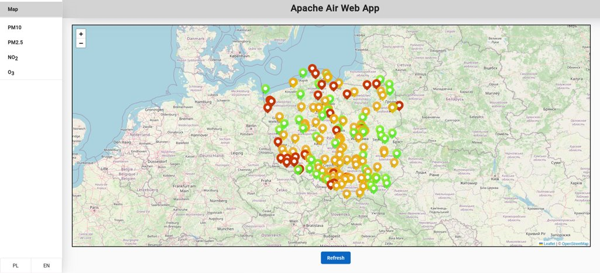

[Paweł](https://github.com/wesolowskip), [Łukasz](https://github.com/luki139) and [Stanisław](https://github.com/matuszewskis) and me created end-to-end project based on big data procesing techniques using the Apache framework.
The goal of our project is to download data from two APIs: [OpenWeather](https://openweathermap.org/api)
and [Air Pollution API](https://powietrze.gios.gov.pl/pjp/content/api), 
and use the data to predict air pollution levels for the upcoming hour. 
We stored the data in Hadoop and retrained predictive models every week to account for new phenomena in the data. 

While our solution may not be very practical, we had to use two free APIs 
to stream data into our home-made data lake, which was a requirement. 
To provide end users with predicted pollution levels with close to zero 
latency, we used stream data processing methods. At the end of our 
solution, we created a web application with a map of Poland where 
users can check pollution levels.

As I mentioned before we used data processing  and storing method 
suitable for large data and data streams, including.
In particular, we used: 
* Apache NiFi
* Apache Kafka
* Apache Hadoop
* Apache Spark/Spark Streaming
* Apache Cassandra

We also made [diagram](container_diagram.pdf) describing our solution. 

The project is quite vast and I took care of: 
* Mock-API - Flask application that artificially converted pollution API data updated every hour to stream of data.
* Apache Spark 
  * Batch processing of data - base training using historical data and retraining every week using collected data
  * Saving pollution levels prediction from stream data to Cassandra database
  * Evaluating models and saving performance metrics to Cassandra database

Whole solution is dockerized and can be run using:
```
docker compose up
```